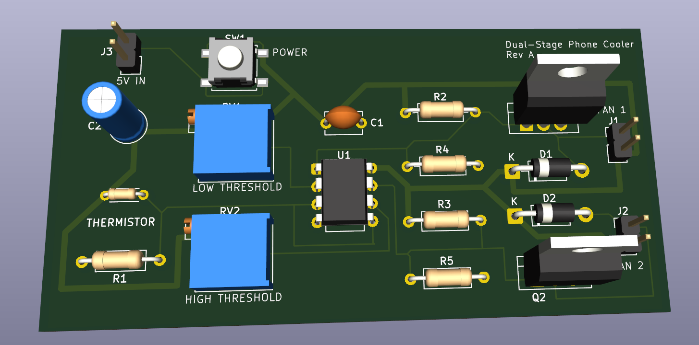
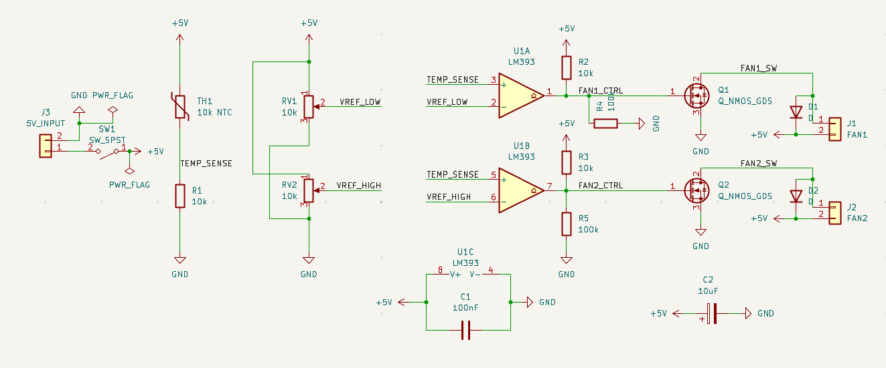
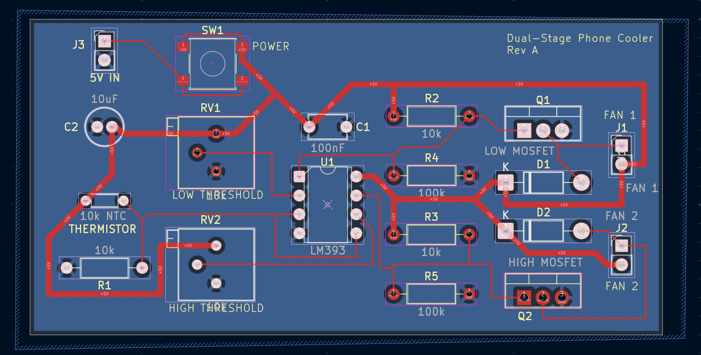
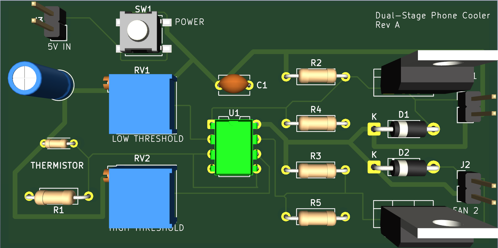
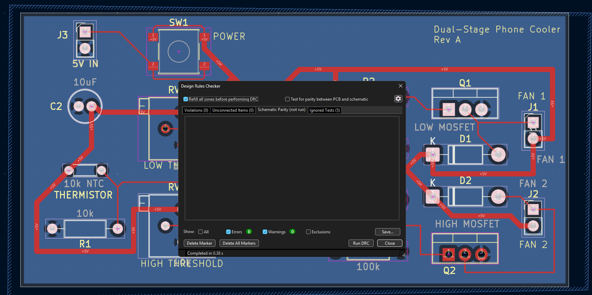

# Dual-Stage Phone Cooler

## Overview

An analog temperature-controlled smartphone cooling system designed
in KiCad. The circuit monitors device surface temperature using an
NTC thermistor and automatically activates two cooling stages based
on independently adjustable temperature thresholds.

## Features

- 10 kΩ NTC thermistor temperature sensing
- Two adjustable temperature thresholds
- LM393 dual-comparator control
- Two-stage fan activation
- N-channel MOSFET fan switching
- Comparator output pull-ups
- Power-supply decoupling
- Flyback/transient protection
- Two-layer PCB layout
- Ground plane
- KiCad DRC: 0 violations / 0 unconnected items

## System Architecture

Thermistor → Voltage Divider → LM393 Comparators → MOSFET Drivers → Fans

## Operation

### Cool
Both fans are off.

### Low Threshold Reached
Fan 1 activates.

### High Threshold Reached
Fan 1 and Fan 2 are active.

## Schematic

## PCB Design

## 3D Model

## Design Decisions

### Temperature Sensing
A 10 kΩ NTC thermistor forms a voltage divider with a fixed
10 kΩ resistor. As temperature rises, thermistor resistance
decreases and TEMP_SENSE increases.

### Threshold Control
Two 10 kΩ potentiometers generate independently adjustable
reference voltages for the LM393 comparators.

### Fan Switching
The LM393 outputs control N-channel MOSFET stages that switch
the fan loads.

### PCB Layout
Low-current analog/control traces are separated from the wider
fan-current paths. A bottom-layer ground plane provides a common
ground return.

## Verification

KiCad Electrical Rules Check and Design Rules Check were used
throughout the design.

Final PCB DRC:
- 0 violations
- 0 unconnected items

## Project Status

This revision is a PCB design prototype and has not been physically
fabricated or validated on manufactured hardware.

## Future Improvements

- Select exact production MOSFET and connector part numbers
- Characterize thermistor thresholds experimentally
- Optimize PCB dimensions
- Manufacture and validate a future revision